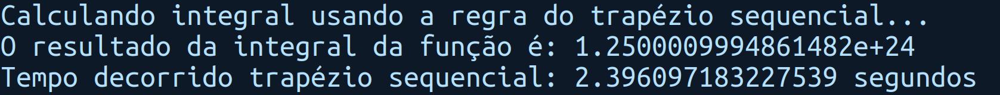
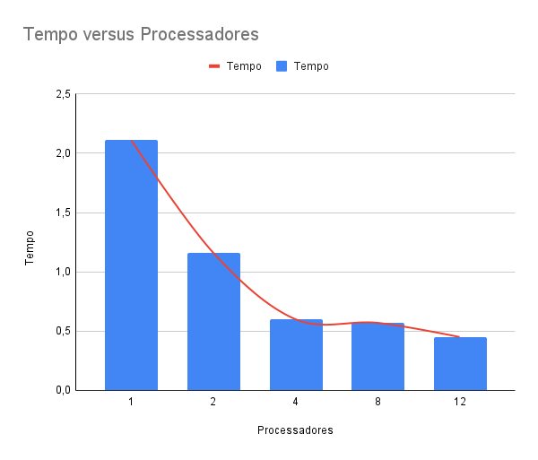

# Relatório - Sistemas Distribuidos

## Aline Rose Alencar Santos

<aside>
1️⃣ Trapézio sequencial

</aside>

<aside>
2️⃣ Método do trapézio utilizando comandos de comunicação coletiva

</aside>

### 1 processo

### 2 processos

### 4 processos

### 8 processos

### 12 processos

<aside>
3️⃣ Método Butterfly

</aside>

### 1 processo

### 2 processos

### 4 processos

### 8 processos

### 12 processos

.png)

<aside>
⏩ Conclusão

</aside>

Dado os resultados, é possível perceber que o método butterfly é bem mais rápido, especialmente utilizando 12 processos.